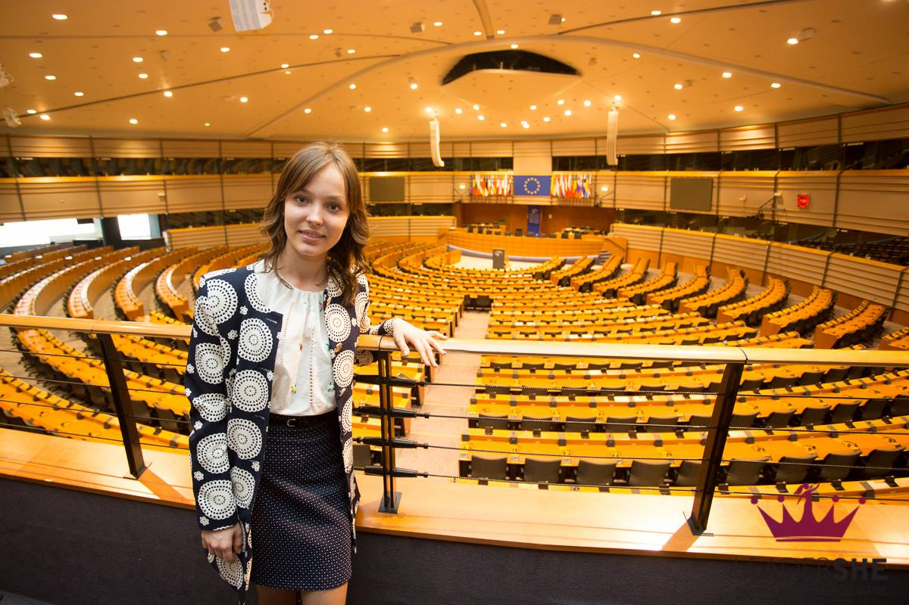

[More information here](https://diez.md/2016/04/19/foto-tinerele-lidere-de-la-leadershe-young-womens-academy-au-vizitat-parlamentul-european/)

According a report released by the Moldovan National Bureau of Statistics, Women and girls occupy only 31% of jobs in the ICT sector in Moldova and only 19% of digital professions. As an advocate for women representation in science and equal gender rights in Moldova, I have been invited by members of the EU Parliament to participate to the dialogue about policy making addressing representation of women in science and politics.

