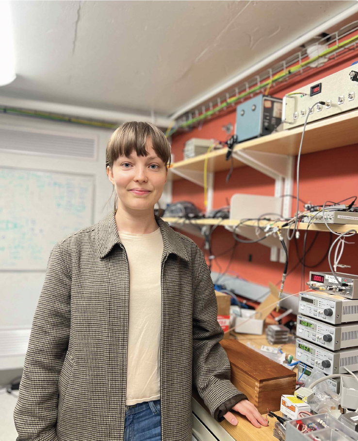

[More information here](https://www.zdg.md/reporter-special/oameni/oameni-tanara-din-r-moldova-absolventa-a-harvard-si-angajata-la-o-companie-cu-renume-mondial-cred-ca-exista-talent-imens-in-domeniul-tehnologiilor-in-r-moldova-care-merita-explorat/)

To make robots understand the complexity of human psychology, for example, feelings of happiness or empathy, researchers first need to understand how to model human thinking and experiences, so that they can then transfer that ability to technologies

