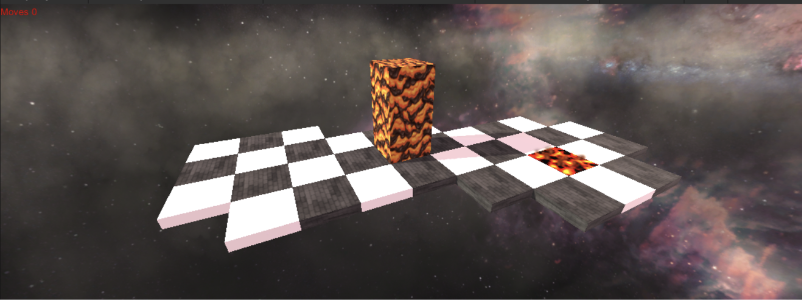

A game akin to Bloxorz in the Unity game engine. The game was built in the 3D framework of the Unity Hub, version 2020.3.6f1. To implement the functioning prototype, I utilized various tools within Unity such as its shader tools, physics engine, scene hierarchy, particle system, lighting engine, and more.

[Access code here](https://github.com/adrianagaler/CS175-FinalProject)

[Download paper here](https://adrianarotaru.github.io/files/game.pdf)

