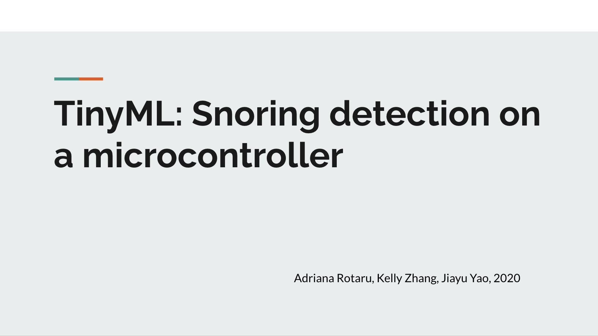

Snoring is related to a common medical condition that can lead to many serious health issues including diabetes, stroke, and depression. Due to the negative health impacts of such medical condition, it is crucial for people to know whether they snore and understand their snoring patterns and triggers of snoring. In this paper, we propose a bed-side snoring detection program on microcontroller device that automatically identifies snoring sounds.

[Access code here](https://github.com/adrianagaler/Snoring-Detection)

